# Install the image for serverless functions
In order to enrich Cloud Guard findings, this integration includes code that will query the Cybereason API and fetch additional information about hosts and users. This code is packaged as a set of serverless functions that will run whenever Cloud Guard detects a problem.

Before you are able to use your functions, you will have to install the image on your Oracle Cloud. To do this:

## Setup the Container Registry
Go to Menu --> Developer Services --> Container Registry and create a Repository
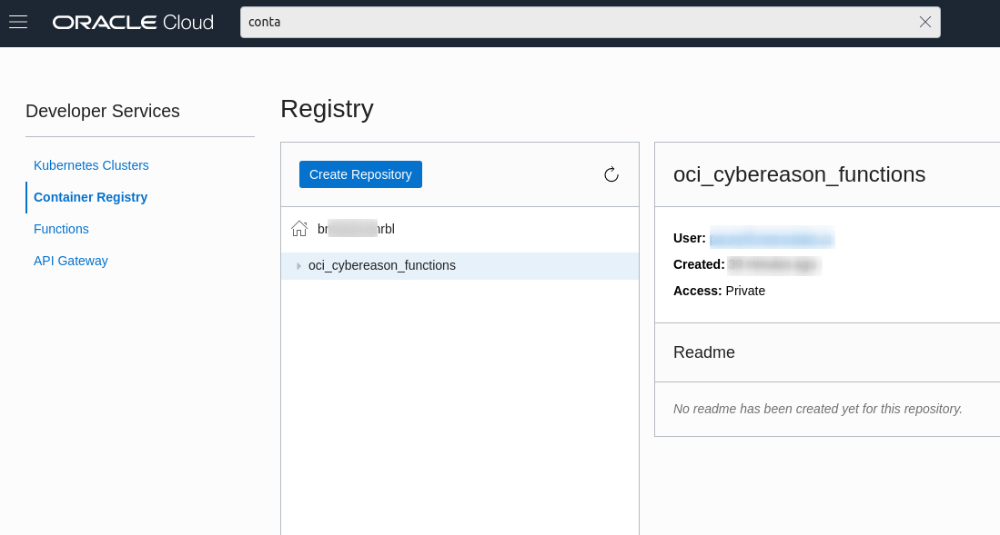

## Using the Cloud Shell
For the following steps, you will need to type commands in to the Oracle Cloud Shell. The shell can be accessed via a button on the top right of your Oracle Cloud site.

## Setup context before building the function
In your cloud shell, use the following commands
1. Run the command `fn list context`
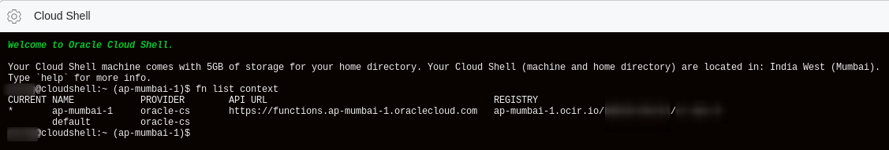
1. Get the Compartment ID (OCID) of the compartment in which you want to deploy the function. You can get the Compartment ID by going to the `Hamburger Menu --> Identity --> Compartments`.
1. Run the command `fn update context oracle.compartment-id <OCID of compartment to store function>`
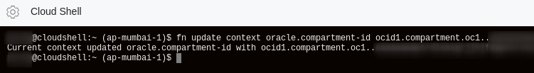
1. Get the Object Storage Namespace and OCIR Repo by going to the `Hamburger Menu --> Developer Services --> Container Registry`

1. Run the command `fn update context registry <region>.ocir.io/<Object Storage Namespace>/<ocir repo>`. Where 
    1. The region is a string like `ap-mumbai-1`
    1. The Object Storage Namespace appears next to the home icon in the Container Registry and is typicaly a 12 character string
    1. The OCIR repo is the name of the repository that you created earlier.
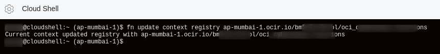
1. Generate an auth token for your user by going to `Hamburger Menu --> Identity --> Users` and click on your username. Generate an auth token and store it in a secure place.
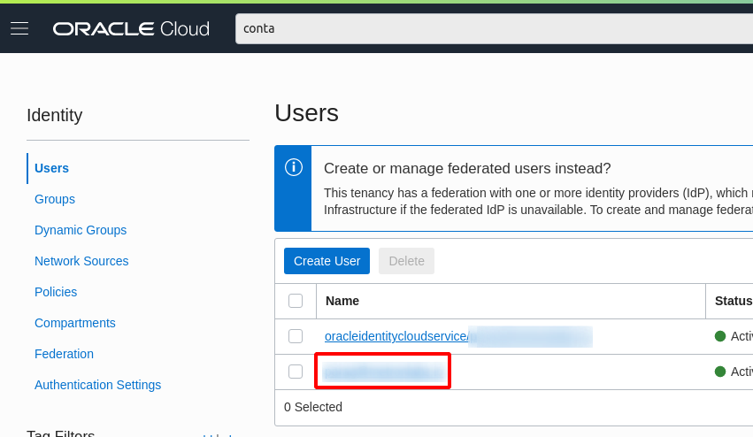
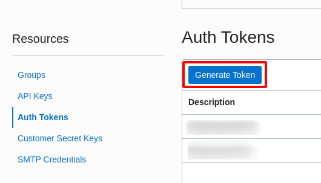
1. Run the command `docker login -u '<Object Storage Namespace>/<username>' <region>.ocir.io`. You will have to paste the auth token generated in the previous step when asked.
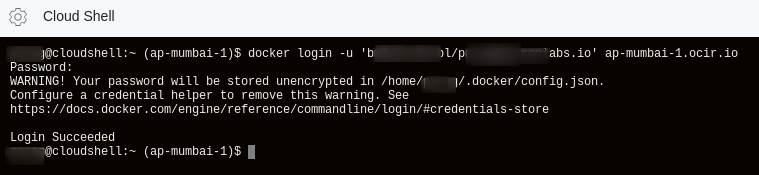

## Build the function image
1. Run the command `fn init --runtime python <function_name>`, where function_name can be "cybereason-responder"
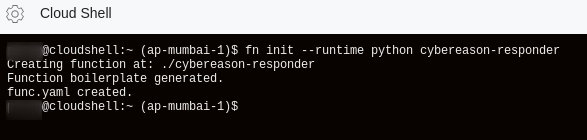
1. Run the command `cd <function_name>` to change into the folder.
1. Copy all the files provided in the `function/` folder of this repo into the current directory. At the end of this step your `cybereason-responder/` folder should have all the files from `function`. Note that the screenshot below is for reference only. You should make sure you have the latest version of all files in the `function/` folder.
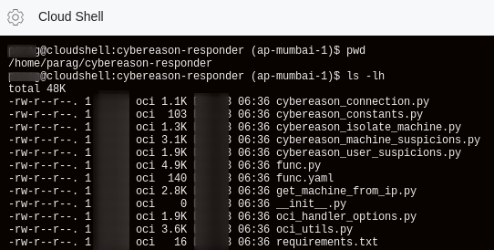
1. Run the command `fn build` to build the function image. This step can take some time.
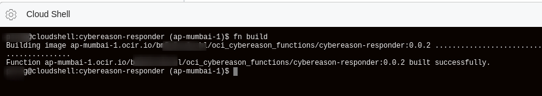
1. Run the command `docker images` to list all the docker images that you have built. Look for the one corresponding to "cybereason-responder". The image string will look like `<region>.ocir.io/<Object Storage Namespace>/<ocir repo>/<function_name>:<tag>`
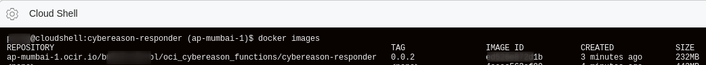
1. Run the command `docker push <image name>`. For image name, paste the entire string that looks like `<region>.ocir.io/<Object Storage Namespace>/<ocir repo>/<function_name>:<tag>`
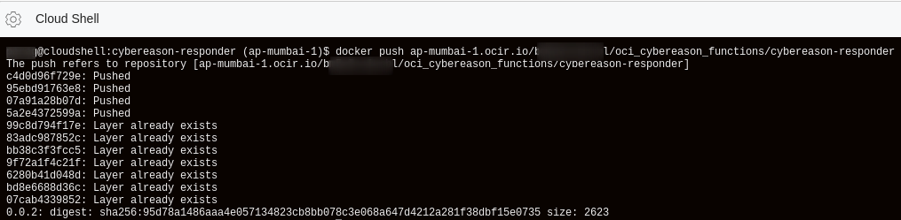
