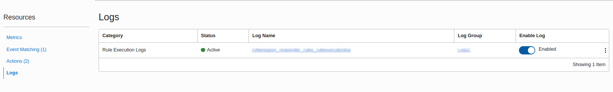
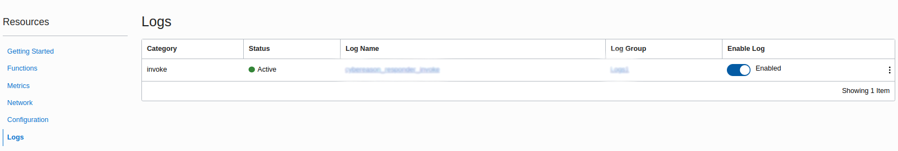

# Enable logging for Event-rule and Function
Logging is disabled by default for event and function created. Enabling logs will help in debugging event/function. Logs can be enabled just after applying terraforms as that will create event rule and function.

## Enable Log for event:
1. To access Event Rule, Go to `Hamburger Icon --> Application Integration --> Events Service` or you can simply search as "event service" in search box.
1. Event Rule should show up in specific compartment where it was created, click on it.
1. As shown in below image, click on Logs and it will show Logs for that event rule. Will show "Not Enabled" first under "Enable Log". Click on it to enable it. Then provide Log name and group and it will enable log.

## Enable Log for functions:
1. To access Function, Go to `Hamburger Icon --> Developer Services --> Functions` or you can simply search as "functions" in search box.
1. Select the specific compartment and Application which contains your function for which logs need to be enabled.
1. As shown in below image, click on Logs and it will show Logs for that event rule. Will show "Disabled" first under "Enable Log". Click on it to enable it. Then provide Log name and it will enable log.

## Finished
Now you can look into logs for functions and event rule!