# Function installation using Terraform templates

## Save the Cybereason Console password as a secret
Your Cybereason Console password needs to be stored as a secret, and the function needs to be configured with the OCID of the secret. To create it:
1. Click on the `Hamburger Icon --> Security --> Vault`
1. Click on `Create Vault` to create a new Vault
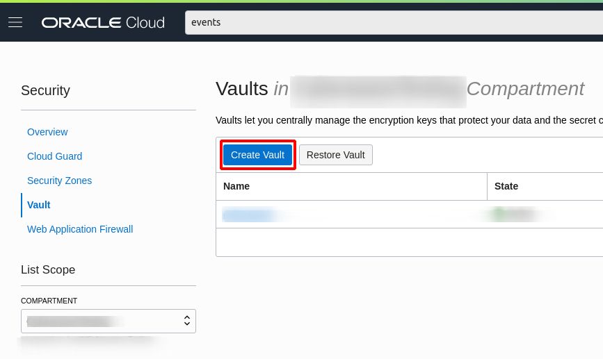
1. Enter a Vault name and click `Create Vault`
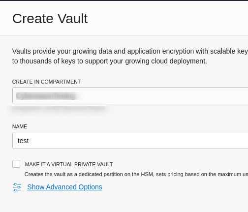
1. Once the Vault is created, click on the name to open it.
1. Click on `Create Key`
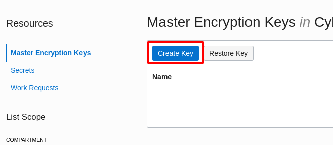
1. Enter the options shown below and click `Create Key`
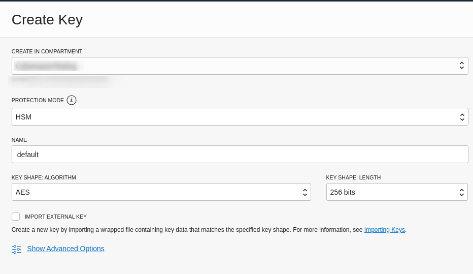
1. Next, click on the `Secrets` section and click `Create Secret`
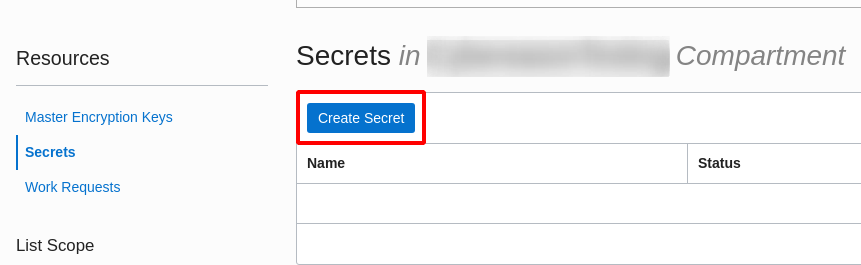
1. Enter the options shown below to create the secret
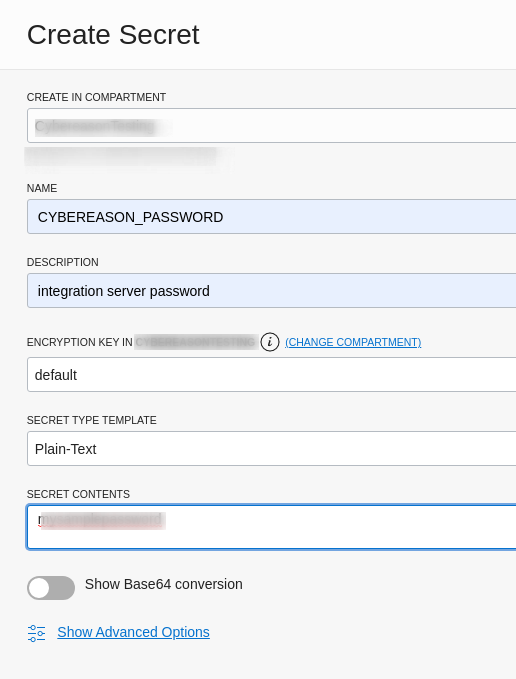
1. Once the secret is created, you can click the options icon for it and copy its OCID. You will need this OCID to configure the function.
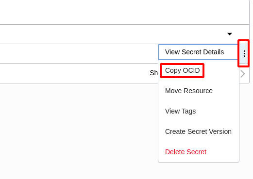

## Compartment OCIDs
You can fetch compartment OCIDs by clicking on the `Hamburger Icon --> Identity --> Compartments`
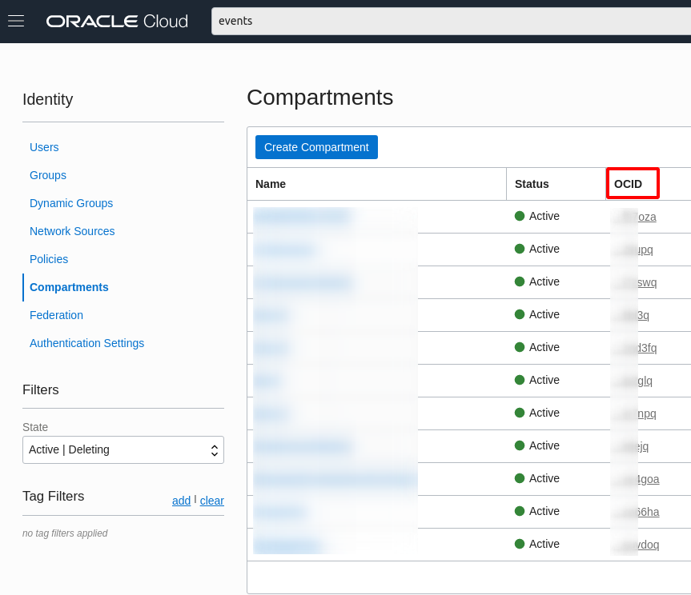

## Detector and Responder recipes
You will need the following TargetDetector OCIDs in order to configure the function:
1. Target Configuration Detector
1. Target Activity Detector

To find these OCIDs, open your Oracle Cloud Shell and type in
```
oci cloud-guard detector-recipe list --compartment-id <tenancy OCID>
where <tenancy OCID> is the OCID of your root compartment
```
From the output which is array of both the detectors, pick the `id` field of each detector. It should look like `ocid1.cloudguarddetectorrecipe.oc1......`

You will also need the following Target Responder recipe:
1. Target Responder

To find this OCI, open your Oracle Cloud Shell and type in
```
oci cloud-guard responder-recipe list --compartment-id <tenancy OCID>
where <tenancy OCID> is the OCID of your root compartment
```
From the output, pick the `id` field. It should look like `ocid1.cloudguardresponderrecipe.oc1......`

## Function Image and Digest
1. Get the Object Storage Namespace and OCIR Repo by going to the `Hamburger Menu --> Developer Services --> Container Registry`
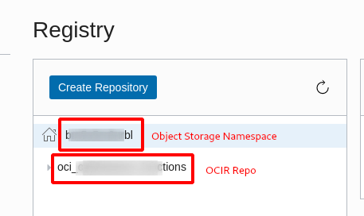
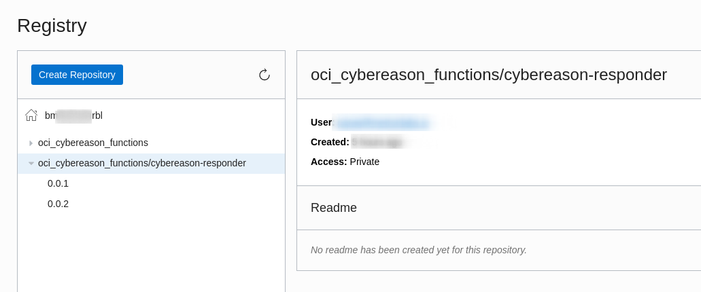
1. The Function image will be the string `<region>.ocir.io/<Object Storage Namespace>/<OCIR Repo>/<function_name>:<tag>`. In the example above, the function image is `bom.ocir.io/bm.......bl/oci_cybereason_functions/cybereason-responder:0.0.1`
1. To find the Function Image Digest, click on the tag you are going to deploy, and the Function Image Digest is available as shown below:
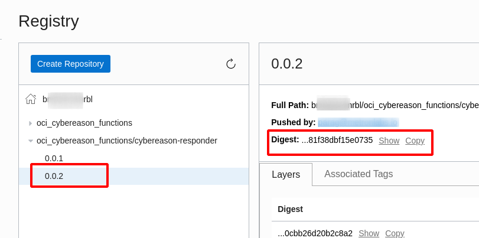


## Gather required variables
The Terraform template requires the user to configure a number of variables. Make sure that you have these before starting the configuration process. The variables you will need are:
|Variable Name|Description|Required|Sample Value|
|---|---|---|---|
|tenancy_ocid|The OCID of the root Oracle tenancy where you will install the integration. This will be populated with your root OCID by default.|Yes|ocid1.compartment.oc1.....|
|region|The region of your Oracle Cloud tenancy. This will be populated by default|Yes|ap-mumbai-1|
|function_compartment_ocid|The OCID of the compartment of your Oracle Cloud Tenancy where you have installed the Cybereason Responder image.|Yes|ocid1.compartment.oc1.....|
|cybereason_server|The Cybereason console to connect to (e.g. integration.cybereason.net)|Yes|integration.cybereason.net|
|cybereason_port|The port used to connect to the Cybereason console. Default is 443|Yes|443|
|cybereason_username|The username used to access the Cybereason console|Yes|jsmith@example.com|
|cybereason_secret_ocid|The OCID of the Secret containing the password used to access the Cybereason server|Yes|ocid1.vaultsecret.oc1.ap-mumbai-1......|
|cybereason_send_notifications|If True, then the Cybereason Responder will send notifications to a specified ONS topic|No|True|
|cybereason_ons_topic_ocid|The OCID of ONS Topic where we will send notifications.|No|ocid1.onstopic.oc1.ap-mumbai-1.....|
|cybereason_isolate_machine|If True, any machine flagged as suspicious will be isolated via the Cybereason sensor|No|True|
|cybereason_disable_user|If True, any user that is flagged as suspicious in the Cybereason console will be disabled in Oracle|Yes|True|
|function_subnet|The VCN Subnet OCID of the subnet the function will execute in.|Yes|ocid1.vcn.oc1.ap-mumbai-1.....|
|function_image|The function image that contains the Cybereason Responder code|Yes|bom.ocir.io/...../...../cybereason-responder:0.0.1|
|function_image_digest|The digest of the function image of the Cybereason Responder code. This is of the format sha256:xxx|Yes|sha256:......|
|target_configuration_detector_recipe_ocid|The OCID of the Target Configuration Detector Recipe to be used|Yes|ocid1.cloudguarddetectorrecipe.oc1.ap-mumbai-1....|
|target_activity_detector_recipe_ocid|The OCID of the Target Activity Detector Recipe to be used|Yes|ocid1.cloudguarddetectorrecipe.oc1.ap-mumbai-1....|
|target_responder_recipe_ocid|The OCID of the Target Responder Recipe to be used|Yes|ocid1.cloudguardresponderrecipe.oc1.ap-mumbai-1.....|

## Configure the stack
1. Go to `Hamburger Menu --> Resource Manager --> Stacks` and create a stack in the compartment where you are going to install the function.
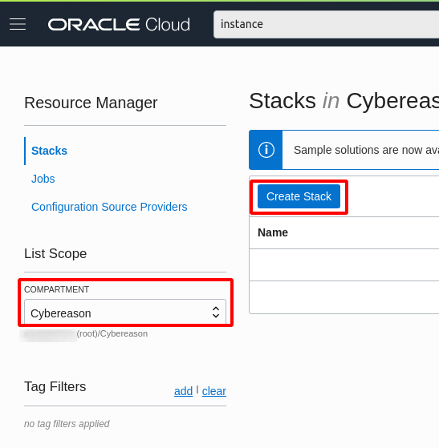
1. Click on "Create Stack" and you can now upload the Terraform files provided in this repo. Upload the entire folder `terraform/` containing all the terraform files. Choose the latest Terraform version.
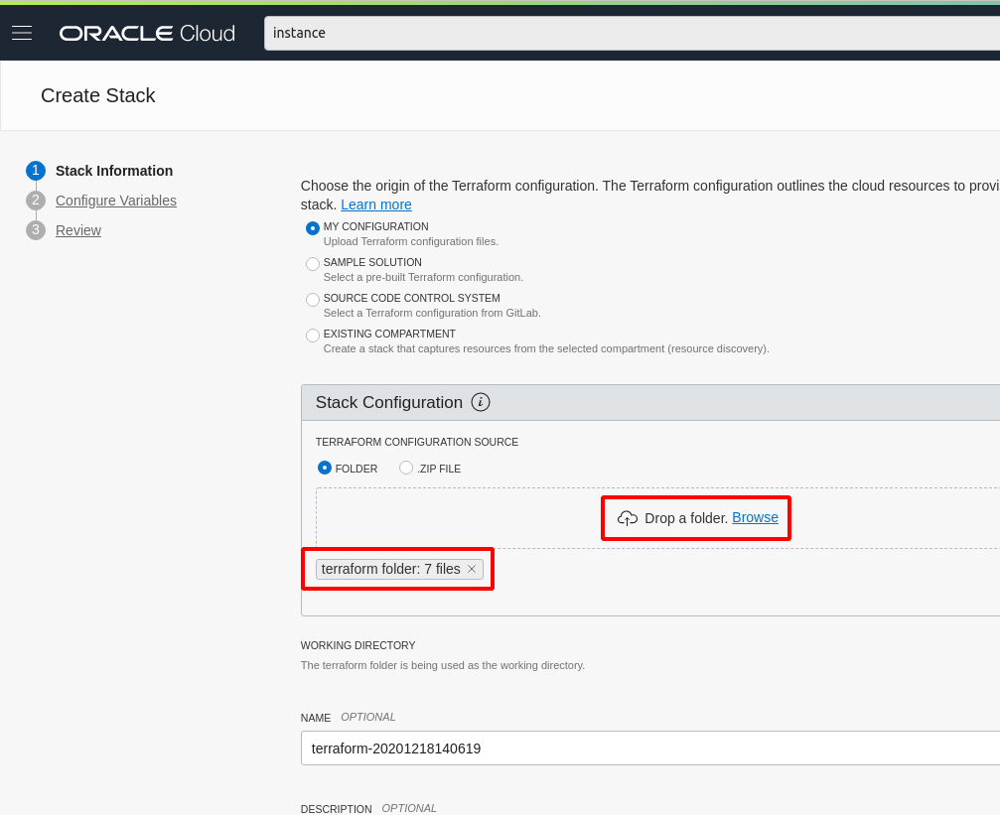
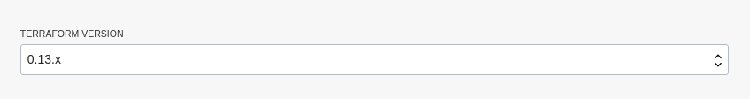
1. Enter all the Terraform configuration variables that you will have collected earlier.
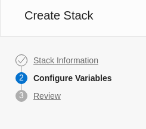
1. Click on `Next` to show the Review page. Once you have reviewed all your changes, click on `Create`.
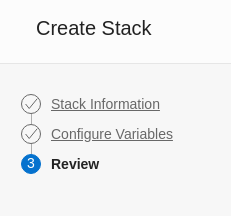

## Plan the Terraform template
Once you have configured variables for the Terraform template, you will need to plan the template. To do this:
1. Go to `Hamburger Menu --> Resource Manager --> Stacks` and click on the Stack you just created.
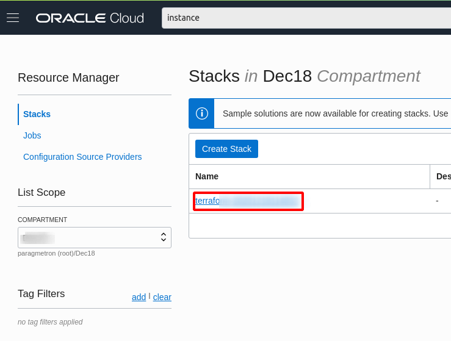
1. Click on `Terraform Actions --> Plan`
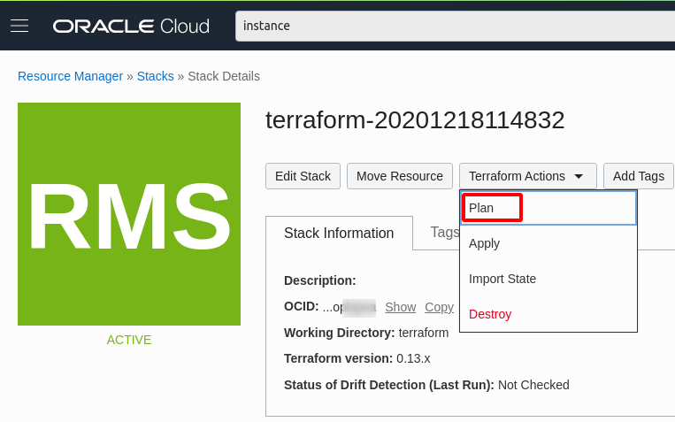
1. This will launch a plan. Once it is successful, you will get a message and some logs in the window.
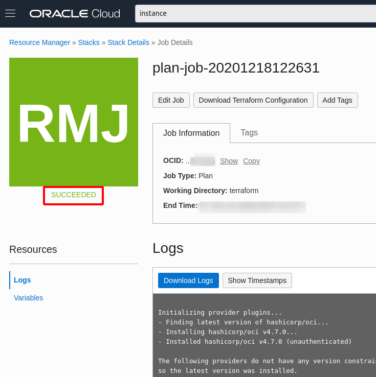

## Apply the Terraform template
Once your Terraform template is planned with no errors, you can apply it:
1. Go to `Hamburger Menu --> Resource Manager --> Stacks` and click on the Stack you just created.

1. Click on `Terraform Actions --> Apply`
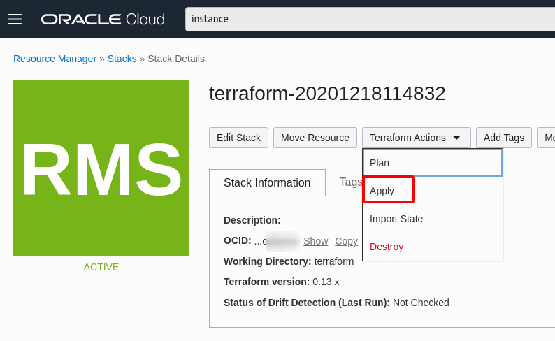
1. This will launch an apply action. Once it is successful, your resources will be created and the Cybereason Responder will start watching Cloud Guard events.

## Finished
That is it! Your Cybereason - Oracle Cloud Guard integration is now successfully installed.